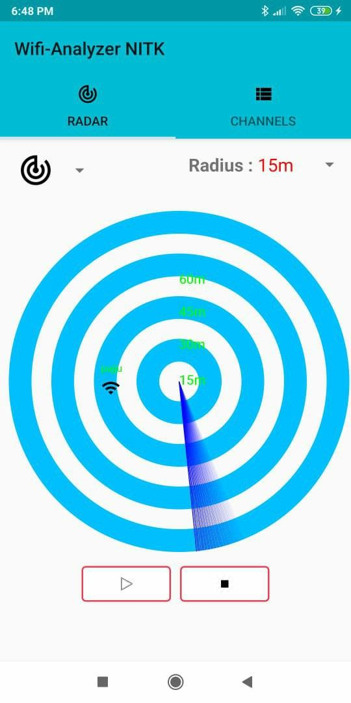
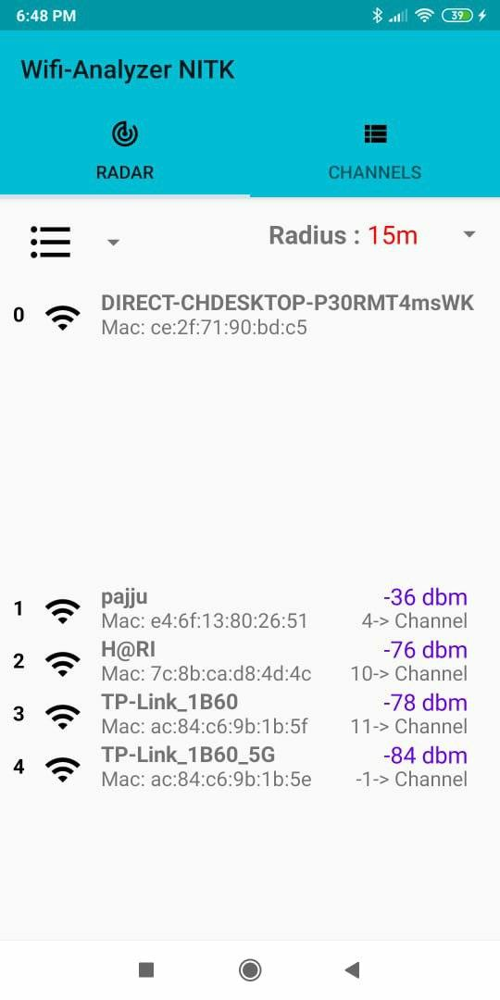
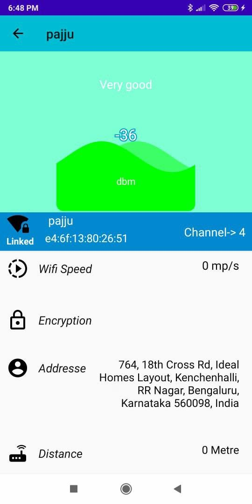
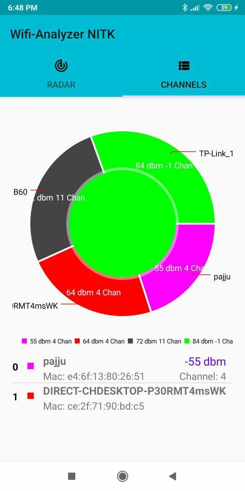

# Wifi-Analyzer

## Wireless Networks Course Assignment

### Features

- [x] Searches for all available wifi networks nearby.
- [x] Details about particular network(Signal Strength, Channel No, Security type).
- [] Show all available channels along with their ratings.
- [] Option to toggle between 2.4GHz and 5 GHz band.

### Screenshots
      

### Team Members

- Prajwal Belagavi (171CO229)
- Varun Pattar (171CO249)
